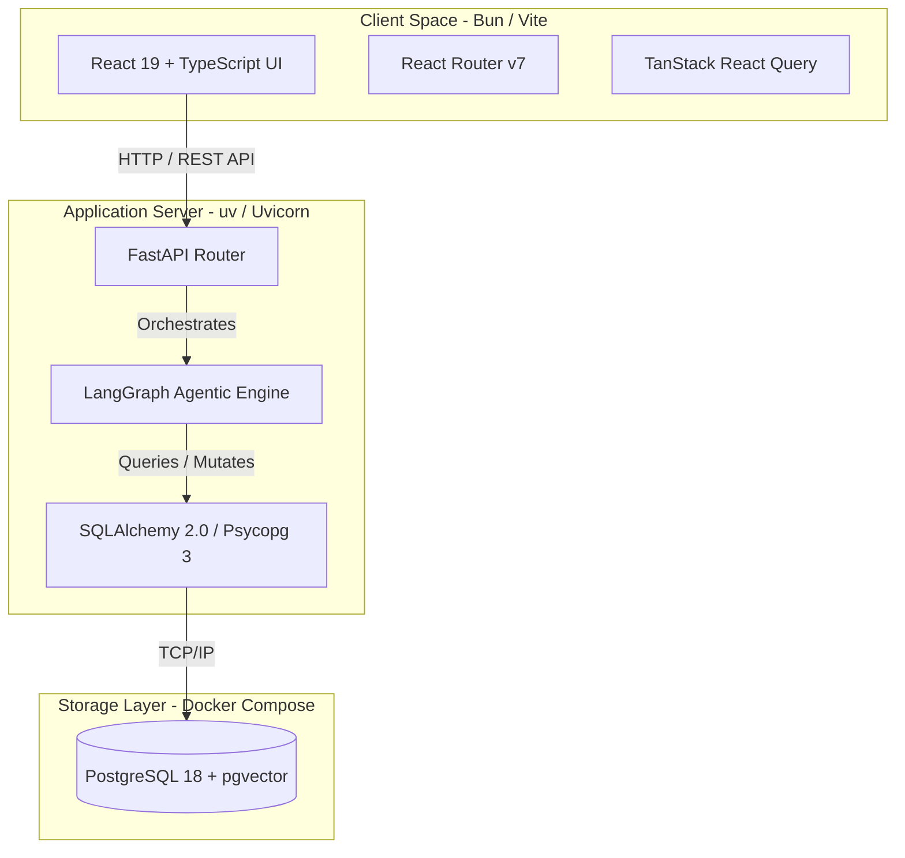

# Smart Vehicle Purchase Consultant (SVPC)

SVPC is a full-stack, AI-powered vehicle purchase consultant designed to guide users through personalized vehicle evaluation, catalog queries, and recommendation synthesis.

---

## System Architecture

SVPC is organized as a monorepo containing three primary runtime boundaries:



### Components

* **Frontend**: A highly responsive Single Page Application (SPA) built using React 19, TypeScript, and Vite, using React Router v7 and TanStack React Query.
* **Backend**: A robust FastAPI server providing REST endpoints (e.g., `/api/v1/consultations`) to create sessions, process queries, and fetch results.
* **Agentic Engine**: An advanced LangGraph-driven workflow (`StateGraph`) orchestrating multi-step consultation states. The workflow comprises:
  * `parse_request`: Deconstructs the user's conversational intent.
  * `clarify_preferences`: Solicits missing parameters or options from the user.
  * `query_catalogue`: Executes structured search queries against the catalogue database.
  * `validate_candidates` & `request_relaxation`: Iteratively narrows or expands vehicle criteria.
  * `score_catalogue_fit`: Computes compatibility metrics for matching finalists.
  * `retrieve_official_documents` & `research_current_costs`: RAG-based extraction of document details and dynamic pricing.
  * `calculate_ownership_cost`: Models total financial commitments over time.
  * `rank_finalists` & `synthesize`: Synthesizes final recommendations with Gemini 3.7.
* **Database Layer**: PostgreSQL 18 with `pgvector` extension for vector semantic search, schema migrations managed through Alembic, and durable session state checkpointing using `langgraph-checkpoint-postgres`.

---

## Tech Stack

### Frontend
* **Core**: React 19, TypeScript 6, Vite 8, React Router v7, TanStack React Query v5.
* **Styling & Assets**: Tailwind CSS 4 (via `@tailwindcss/vite`), `@base-ui/react`, Framer Motion, Lucide React.
* **Runtime**: Bun runtime and package manager.

### Backend
* **Core**: Python 3.12+, FastAPI, Uvicorn (ASGI web server).
* **AI/LLM**: LangGraph 1.2, LangChain, `langchain-google-genai` (Gemini 3.7 Flash), `pgvector` for semantic embeddings.
* **Data Access**: SQLAlchemy 2.0, Psycopg 3 (native Postgres driver).
* **Runtime & Package Management**: `uv` package manager.

### Operations & Tooling
* **Database**: PostgreSQL 18 with `pgvector` in Docker Compose.
* **Task Runner**: `just` (Rust-based command runner).
* **Database Migrations**: Alembic.
* **Checks & Linters**: Ruff (formatter/linter), mypy (static type analysis), pytest.

---

## Project Structure

```text
├── .agents/                # Custom agent behavior rules and guidelines
├── backend/                # FastAPI application, agentic models, and migrations
│   ├── app/                # Main application package
│   │   ├── agentic/        # LangGraph definitions, nodes, and tool wrappers
│   │   ├── api/            # API Router groups (V1 routes for consultations, health)
│   │   ├── core/           # Settings, configurations, and core lifecycles
│   │   ├── db/             # Database connection setups and session makers
│   │   └── etl/            # Extractor-Transformer-Loader utilities for catalogue ingestion
│   ├── alembic/            # Database schema migrations
│   └── tests/              # Pytest backend test suite
├── frontend/               # React client application code
├── docs/                   # ADRs, architectures, and database schemas
├── compose.yaml            # PostgreSQL service definition
├── justfile                # Unified project commands definition
└── pyproject.toml          # Root package specifications and dev dependencies
```

---

## Local Development Guide

### Prerequisites
* Docker & Docker Compose
* Bun (JavaScript Runtime)
* `uv` (Python Package Manager)
* `just` command runner (`brew install just` on macOS)
* A valid Google Gemini API Key

### Setup & Startup

1. **Environment Configuration**:
   Copy the example environment configuration to create your local `.env`:
   ```bash
   cp .env.example .env
   ```
   Open `.env` and fill in your `GEMINI_API_KEY`. 
   
   *Note: If your system already runs a local PostgreSQL service on port `5432`, change the `DATABASE_PORT` in both `.env` and `backend/.env` to `5434` (or any other free port).*

2. **Initialize Workspace**:
   Run the setup recipe to start PostgreSQL in Docker, apply Alembic migrations, and install dependencies:
   ```bash
   just setup
   ```

3. **Start Development Servers**:
   Run the dev servers for both backend and frontend concurrently:
   ```bash
   just dev
   ```
   * The frontend will be available at `http://localhost:5173`
   * The backend API documentation will be at `http://localhost:8000/docs`

---

## Development Commands (`justfile` Recipes)

A central task manager is implemented using a [justfile](file:///Users/kshitizagg/Documents/SVPC/justfile). The key recipes are:

* `just setup`: Prepares the development workspace (initializes Docker database, updates schema migrations, runs agent storage setup script, installs frontend dependencies).
* `just dev`: First-class entry point that launches `just setup` and starts the FastAPI server and Vite dev server concurrently.
* `just backend`: Starts only the FastAPI reload server (`uvicorn app.main:app --reload`) from the backend directory.
* `just frontend`: Starts only the Vite frontend dev server using `bun`.
* `just run-servers`: Concurrently executes `backend` and `frontend` servers on the host.

---

## Quality Assurance & Verification

Before submitting code, run the following verification checks:

```bash
# Navigate to backend directory
cd backend

# Lint and format checks
uv run ruff check .

# Static type check
uv run mypy app

# Run backend unit tests
uv run pytest
```
