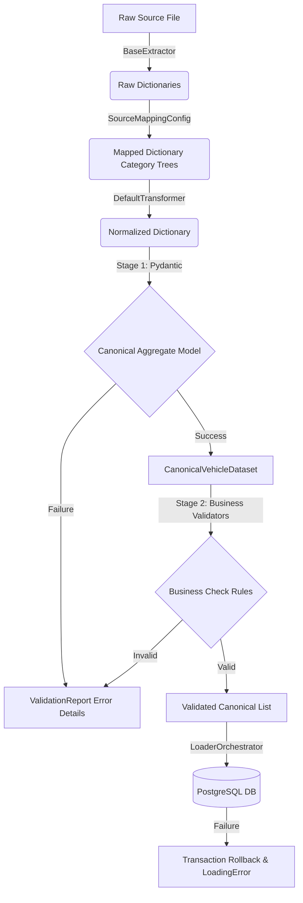

# ETL Architecture

This document describes the design, directory structure, data processing flow, and responsibilities of each layer within the SVPC ETL (Extract, Transform, Load) framework.

---

## 1. Architectural Overview

The SVPC ETL framework is designed to ingest raw data from multiple sources (such as CSV, JSON, and Excel) and normalize, validate, and load it into PostgreSQL. 

The framework is decoupled and designed around **SOLID principles**:
- **Source-Agnostic Extractor Layer:** Decoupled from mappings and transforms.
- **Declarative Field Mapping Registry:** Keeps field mappings separate from conversion logic.
- **Aggregated Canonical Models:** Guarantees strongly typed data passing between pipeline stages.
- **Two-Stage Validation Pipeline:** Decoupled type validation (Pydantic) and semantic business check validation (ranges, duplicates, etc.).
- **Transactional DB Loaders:** Handled sequentially by entity dependency logic (Brand -> Vehicle -> Specifications).

---

## 2. Execution Flow Diagram



---

## 3. Directory Layout & Responsibilities

- **`app/etl/extract/`:** Exposes file readers.
  - `base.py`: Declares `BaseExtractor` interface.
  - `csv_extractor.py`, `json_extractor.py`, `excel_extractor.py`: Read file contents into Python dict arrays.
- **`app/etl/mapping/`:** Exposes translation configurations.
  - `schema.py`: Declares source field config mapping specifications.
  - `registry.py`: Holds mapping configurations by source identifier.
- **`app/etl/models/`:** Strong canonical schemas utilizing Pydantic.
  - `brand.py`, `vehicle.py`, `specs.py`: Entity schemas.
  - `dataset.py`: `CanonicalVehicleDataset` aggregates brand, vehicle, and specs into a single object.
- **`app/etl/transform/`:** Handles value cleanup.
  - `enums.py`: Normalizes variations of strings into standard Enum constants.
  - `units.py`: Standardizes input units (e.g. converting "1497 cc" -> `1497`, "16.8 kmpl" -> `16.8`).
  - `text.py`: Normalizes whitespaces, casing, and removes extra special characters.
  - `defaults.py`: Applies source defaults to missing optional spec fields.
  - `base.py`: Exposes `DefaultTransformer` class executing these cleanup routines.
- **`app/etl/validators/`:** Structural validation.
  - `pipeline.py`: Orchestrates Stage 1 (Pydantic) and Stage 2 (Required, Numeric Ranges, Enums, Duplicates, and Foreign Key checks).
  - `models.py`: Declares `ValidationErrorDetail` and `ValidationReport` to capture batch failures without throwing exceptions.
- **`app/etl/load/`:** DB writes.
  - `brand_loader.py`: Gets or creates Brand records in DB.
  - `vehicle_loader.py`: Inserts Vehicle variants.
  - `specs_loader.py`: Inserts all 7 related specification tables using the Vehicle ID.
  - `orchestrator.py`: Manages transactions, rollback, batch chunks, and commits.
- **`app/etl/utils/`:** Utilities.
  - `logging.py`: Structured logger configuration.
  - `metrics.py`: Telemetry statistics (extracted, transformed, validated, rejected, loaded).
  - `timer.py`: Context manager for measuring execution time.

---

## 4. Extension Points

To onboard a new data source:
1. Declare a mapping configuration (`SourceMappingConfig`) specifying how raw input columns map to canonical target fields.
2. Register the mapping config inside the `mapping_registry` in `app/etl/mapping/registry.py` or within a dedicated module under `app/etl/mapping/mappings/`.
3. Invoke the pipeline:
   ```python
   from app.etl import ETLPipeline
   from app.etl.extract import CSVExtractor

   pipeline = ETLPipeline(source_name="your_new_source", extractor=CSVExtractor())
   report = pipeline.run("data/raw/your_new_source.csv")
   ```
